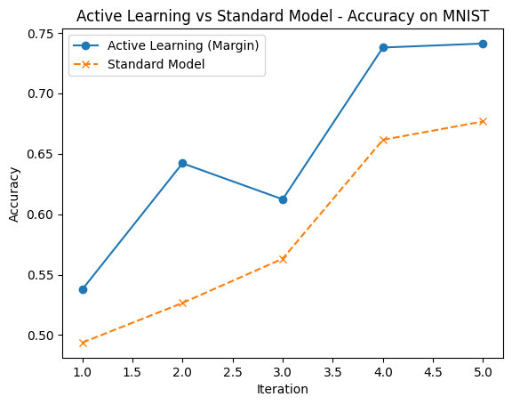

# Active Learning on MNIST: Teaching a CNN Where to Look

## Description  
I'm trying to classify MNIST digits but with **less data** during the training process.

I wanted to explore how **Active Learning** can help a model improve faster by **asking the right questions** or more concretely, by selecting the most uncertain examples to label and learn from. 

I'm going to use a simple CNN, start with just 100 labeled samples, and then iteratively add the most "confusing" images using a **margin sampling strategy**.

In parallel, I also trained a **standard baseline model** that just gets random new samples at each iteration so we can compare and see if this "smart training" is actually worth it.

---

## Technologies Used  
- **Python 3.10**  
- **TensorFlow / Keras**  
- **scikit-learn**  
- **matplotlib**  
- **NumPy**

---

## How to Run  
You can just run the script directly on collab

---

## Results

After 5 rounds of active learning (so only ~150 samples in total!), we compare both models:

### 📈 Learning curve  
You can see on the grave that the active learner improves a bit faster, especially in the early rounds showing that the model benefits from choosing the right training points rather than just more data. Throughout a lot of tries, this method seems to be a little bit better than a classical one.

